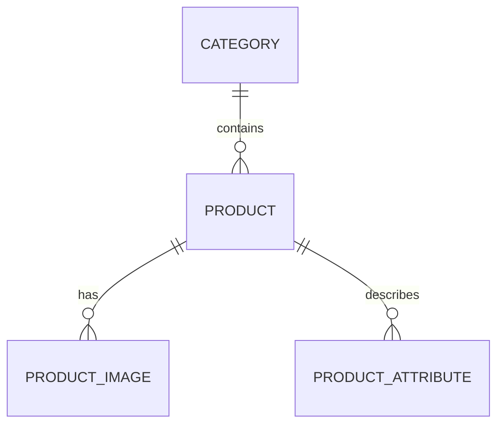

# products-service. Структура базы данных

## 1. Назначение сервиса

`products-service` хранит и отдает данные каталога, категорий, изображений и характеристик товаров. Сервис используется как публичной витриной, так и админ-панелью.

## 2. Схема сущностей

## 3. Таблицы

### 3.1. `categories`

Назначение: хранение категорий каталога.

| Поле | Тип | Ограничения | Описание |
| --- | --- | --- | --- |
| id | uuid | PK | Идентификатор категории |
| name | varchar(120) | not null | Название категории |
| slug | varchar(120) | unique, not null | URL-идентификатор |
| description | text | null | Описание категории |
| sort_order | int | default 0 | Порядок отображения |
| created_at | timestamptz | not null | Дата создания |
| updated_at | timestamptz | not null | Дата обновления |

### 3.2. `products`

Назначение: основная карточка товара.

| Поле | Тип | Ограничения | Описание |
| --- | --- | --- | --- |
| id | uuid | PK | Идентификатор товара |
| category_id | uuid | FK -> categories.id, not null | Категория |
| sku | varchar(64) | unique, not null | Артикул |
| name | varchar(255) | not null | Название |
| slug | varchar(255) | unique, not null | SEO slug |
| short_description | varchar(500) | null | Короткое описание |
| description | text | null | Полное описание |
| base_price | numeric(10,2) | not null | Базовая цена |
| discount_price | numeric(10,2) | null | Цена со скидкой |
| currency_code | char(3) | default 'RUB' | Валюта |
| stock_qty | int | not null, default 0 | Остаток |
| power_watts | int | not null | Мощность |
| socket_type | varchar(32) | not null | Тип цоколя |
| color_temperature | varchar(32) | not null | Цветовая температура |
| luminous_flux | int | null | Световой поток, lm |
| voltage | varchar(32) | null | Напряжение |
| lifetime_hours | int | null | Ресурс |
| is_dimmable | boolean | default false | Диммирование |
| is_active | boolean | default true | Публикация товара |
| created_at | timestamptz | not null | Дата создания |
| updated_at | timestamptz | not null | Дата обновления |
| deleted_at | timestamptz | null | Мягкое удаление |

### 3.3. `product_images`

Назначение: изображения товара.

| Поле | Тип | Ограничения | Описание |
| --- | --- | --- | --- |
| id | uuid | PK | Идентификатор изображения |
| product_id | uuid | FK -> products.id, not null | Товар |
| image_url | text | not null | Ссылка на изображение |
| alt_text | varchar(255) | null | Alt-текст |
| sort_order | int | default 0 | Порядок показа |
| is_main | boolean | default false | Признак главного изображения |
| created_at | timestamptz | not null | Дата создания |

### 3.4. `product_attributes`

Назначение: произвольные характеристики, выводимые в карточке товара.

| Поле | Тип | Ограничения | Описание |
| --- | --- | --- | --- |
| id | uuid | PK | Идентификатор характеристики |
| product_id | uuid | FK -> products.id, not null | Товар |
| attribute_name | varchar(120) | not null | Название характеристики |
| attribute_value | varchar(255) | not null | Значение |
| sort_order | int | default 0 | Порядок вывода |
| created_at | timestamptz | not null | Дата создания |

## 4. Индексы

- `idx_products_category_id`
- `idx_products_slug`
- `idx_products_is_active`
- `idx_products_socket_type`
- `idx_products_stock_qty`
- полнотекстовый индекс по `name`, `sku`, `short_description`

## 5. Правила хранения данных

- товар не удаляется физически, а помечается через `deleted_at`;
- если `discount_price` заполнена, витрина показывает ее как текущую цену;
- товар доступен на витрине только при `is_active = true` и `deleted_at is null`;
- если `stock_qty = 0`, товар остается видимым, но без активной кнопки покупки;
- минимум одно изображение на активный товар обязательно.

## 6. Связь с прототипами

Эта структура покрывает:

- каталог с фильтрами по категории, цоколю, температуре и наличию;
- карточку товара с галереей;
- отображение цены, старой цены, остатка и характеристик;
- админскую форму создания и редактирования товара.
