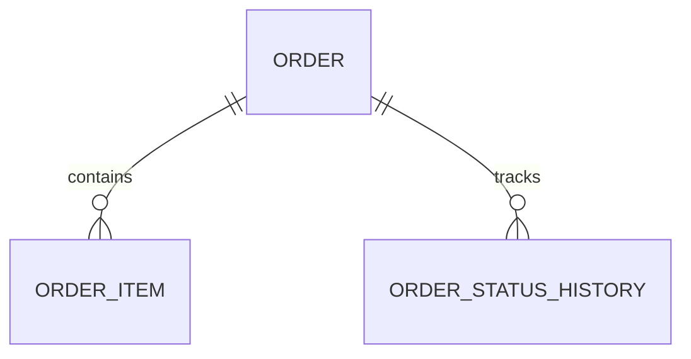

# orders-service. Структура базы данных

## 1. Назначение сервиса

`orders-service` отвечает за оформление заказа, хранение состава заказа, адресных данных, статусов и истории изменений.

## 2. Схема сущностей

## 3. Таблицы

### 3.1. `orders`

Назначение: шапка заказа и данные покупателя.

| Поле | Тип | Ограничения | Описание |
| --- | --- | --- | --- |
| id | uuid | PK | Идентификатор заказа |
| order_number | varchar(32) | unique, not null | Номер заказа |
| customer_name | varchar(255) | not null | ФИО |
| customer_phone | varchar(32) | not null | Телефон |
| customer_email | varchar(255) | not null | Email |
| delivery_city | varchar(120) | not null | Город |
| delivery_address | varchar(255) | not null | Адрес |
| delivery_method | varchar(32) | not null | `courier`, `pickup` |
| payment_method | varchar(32) | not null | `card_online`, `cash_on_delivery` |
| order_status | varchar(32) | not null | Текущий статус заказа |
| payment_status | varchar(32) | not null | Текущий статус оплаты |
| customer_comment | text | null | Комментарий клиента |
| manager_comment | text | null | Внутренний комментарий менеджера |
| subtotal_amount | numeric(10,2) | not null | Сумма без доставки |
| delivery_amount | numeric(10,2) | not null | Стоимость доставки |
| total_amount | numeric(10,2) | not null | Итоговая сумма |
| currency_code | char(3) | default 'RUB' | Валюта |
| public_token | varchar(128) | not null | Токен для публичного просмотра заказа |
| created_at | timestamptz | not null | Дата создания |
| updated_at | timestamptz | not null | Дата обновления |

### 3.2. `order_items`

Назначение: позиции заказа в виде снапшота товара на момент покупки.

| Поле | Тип | Ограничения | Описание |
| --- | --- | --- | --- |
| id | uuid | PK | Идентификатор позиции |
| order_id | uuid | FK -> orders.id, not null | Ссылка на заказ |
| product_id | uuid | not null | Идентификатор товара в каталоге |
| sku_snapshot | varchar(64) | not null | SKU на момент заказа |
| product_name_snapshot | varchar(255) | not null | Название на момент заказа |
| product_slug_snapshot | varchar(255) | not null | Slug на момент заказа |
| unit_price | numeric(10,2) | not null | Цена единицы |
| quantity | int | not null | Количество |
| line_total | numeric(10,2) | not null | Сумма позиции |
| attributes_snapshot | jsonb | null | Снимок основных характеристик |
| created_at | timestamptz | not null | Дата создания |

### 3.3. `order_status_history`

Назначение: история статусов заказа.

| Поле | Тип | Ограничения | Описание |
| --- | --- | --- | --- |
| id | uuid | PK | Идентификатор события |
| order_id | uuid | FK -> orders.id, not null | Заказ |
| old_status | varchar(32) | null | Предыдущий статус |
| new_status | varchar(32) | not null | Новый статус |
| changed_by | varchar(255) | not null | Кто изменил статус |
| source | varchar(32) | not null | `system`, `admin`, `customer` |
| comment | text | null | Комментарий к смене статуса |
| created_at | timestamptz | not null | Дата события |

## 4. Индексы

- `idx_orders_order_number`
- `idx_orders_created_at`
- `idx_orders_order_status`
- `idx_orders_payment_status`
- `idx_orders_customer_phone`
- `idx_order_items_order_id`
- `idx_order_status_history_order_id`

## 5. Бизнес-правила

- заказ создается только если все позиции успешно провалидированы через `products-service`;
- после создания заказа позиции сохраняются как снапшоты, чтобы история заказа не зависела от будущих изменений каталога;
- допустимые переходы статусов:
  - `new -> confirmed`
  - `confirmed -> assembling`
  - `assembling -> shipped`
  - `shipped -> delivered`
  - `new -> canceled`
  - `confirmed -> canceled`
- каждое изменение статуса фиксируется в `order_status_history`;
- `public_token` используется для страницы подтверждения заказа без отдельной регистрации пользователя.

## 6. Связь с прототипами

Структура покрывает:

- форму оформления заказа;
- страницу подтверждения заказа;
- таблицу заказов в админке;
- карточку заказа с историей статусов.
