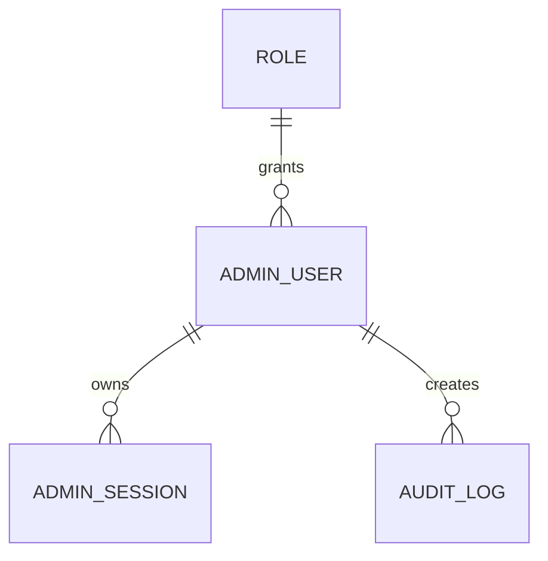

# admin-panel-service. Структура базы данных

## 1. Назначение сервиса

`admin-panel-service` обеспечивает авторизацию сотрудников, хранение ролей, refresh-сессий и журнала действий операторов в админ-панели.

## 2. Схема сущностей

## 3. Таблицы

### 3.1. `roles`

Назначение: справочник ролей сотрудников.

| Поле | Тип | Ограничения | Описание |
| --- | --- | --- | --- |
| id | uuid | PK | Идентификатор роли |
| code | varchar(64) | unique, not null | `admin`, `content_manager`, `order_manager` |
| name | varchar(120) | not null | Название роли |
| description | text | null | Описание роли |
| created_at | timestamptz | not null | Дата создания |

### 3.2. `admin_users`

Назначение: учетные записи сотрудников.

| Поле | Тип | Ограничения | Описание |
| --- | --- | --- | --- |
| id | uuid | PK | Идентификатор пользователя |
| role_id | uuid | FK -> roles.id, not null | Роль |
| full_name | varchar(255) | not null | ФИО сотрудника |
| email | varchar(255) | unique, not null | Email |
| password_hash | varchar(255) | not null | Хеш пароля |
| is_active | boolean | default true | Активность |
| last_login_at | timestamptz | null | Последний вход |
| created_at | timestamptz | not null | Дата создания |
| updated_at | timestamptz | not null | Дата обновления |
| deleted_at | timestamptz | null | Мягкое удаление |

### 3.3. `admin_sessions`

Назначение: refresh-сессии сотрудников.

| Поле | Тип | Ограничения | Описание |
| --- | --- | --- | --- |
| id | uuid | PK | Идентификатор сессии |
| admin_user_id | uuid | FK -> admin_users.id, not null | Пользователь |
| refresh_token_hash | varchar(255) | not null | Хеш refresh-токена |
| user_agent | varchar(255) | null | Браузер/клиент |
| ip_address | inet | null | IP-адрес |
| expires_at | timestamptz | not null | Срок действия |
| revoked_at | timestamptz | null | Время отзыва |
| created_at | timestamptz | not null | Дата создания |

### 3.4. `audit_logs`

Назначение: журнал действий в админ-панели.

| Поле | Тип | Ограничения | Описание |
| --- | --- | --- | --- |
| id | uuid | PK | Идентификатор записи |
| admin_user_id | uuid | FK -> admin_users.id, not null | Кто выполнил действие |
| action | varchar(120) | not null | Тип действия |
| entity_type | varchar(64) | not null | `product`, `order`, `auth` |
| entity_id | varchar(120) | null | Идентификатор сущности |
| request_payload | jsonb | null | Что было отправлено |
| response_code | int | not null | HTTP-код результата |
| created_at | timestamptz | not null | Когда произошло действие |

## 4. Индексы

- `idx_admin_users_email`
- `idx_admin_users_role_id`
- `idx_admin_sessions_admin_user_id`
- `idx_admin_sessions_expires_at`
- `idx_audit_logs_admin_user_id`
- `idx_audit_logs_entity_type`
- `idx_audit_logs_created_at`

## 5. Бизнес-правила

- авторизоваться могут только пользователи с `is_active = true` и `deleted_at is null`;
- пароль хранится только в виде хеша;
- при каждом входе создается refresh-сессия;
- при logout соответствующая сессия помечается как отозванная;
- каждое изменение товара и статуса заказа должно фиксироваться в `audit_logs`.

## 6. Связь с прототипами

Структура покрывает:

- форму логина;
- контроль ролей и доступа;
- журнал последних действий на дашборде;
- аудит операций в разделах товаров и заказов.
